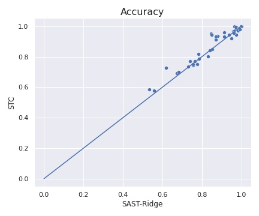
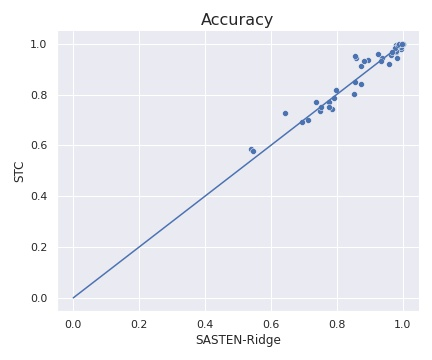
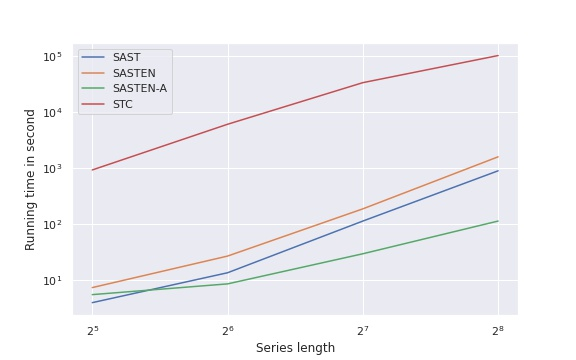
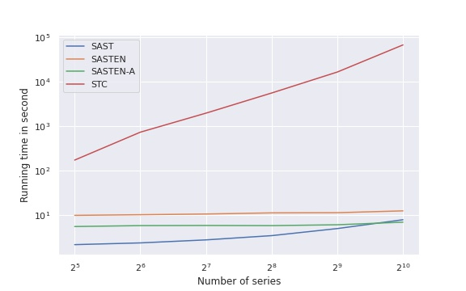
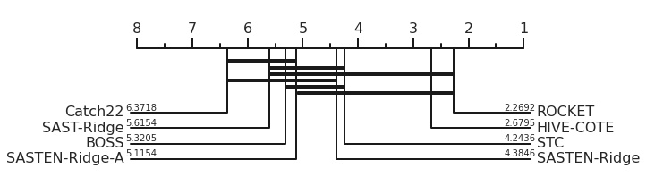

# SAST: Scalable and Accurate Subsequence Transform

SAST a more scalable alternative to the Shapelet Transform algorithm STC. SAST achieves almost the same accuracy as STC, but is much more scalable.


SASTEN is an ensemble of $3$ SAST models. SASTEN is more accurate than SAST and more scalable than STC.


SASTEN-A is an ensemble of $3$ approximated SAST models. The approximation is done by considering only a subset of the subsequences in the dataset.


### Results

- [All models results](./results/models_acc.csv)
- [SAST](./results/results-rf-ridge.csv)
- [Approximated SAST: SAST-A](./results/results-sast-approx.csv)
- [Ensemble of approximated SAST: SASTEN-A](./results/results-sast-ensemble-approx.csv)
- [Ensemble of SAST: SASTEN](./results/results-sast-ensemble-full.csv)
- [Execution time regarding the number of series](./results/results-scalability-number-of-series.csv)
- [Execution time regarding series length](./results/results-scalability-series-length.csv)


### Accuracy plots

|                                           |                                             |
| ----------------------------------------- | ------------------------------------------- |
|  |  |


### Scalability plots

- Regarding the length of time series



- Regarding the number of time series in the dataset



### Comparison to SOTA



## Usage

```python
import numpy as np
from utils import *
from sast import *
from sklearn.linear_model import RidgeClassifierCV

clf = RidgeClassifierCV(alphas=np.logspace(-3, 3, 10))
sast_ridge = SAST(cand_length_list=np.arange(min_shp_length, max_shp_length+1),
		          nb_inst_per_class=nb_inst_per_class, 
		          random_state=None, classifier=clf)

sast_ridge.fit(X_train, y_train)

prediction = sast_ridge.predict(X_test)
```

### Dependencies

- numpy == 1.18.5
- numba == 0.50.1
- scikit-learn == 0.23.1
- sktime == 0.4.1

