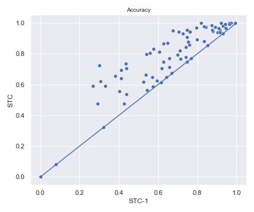
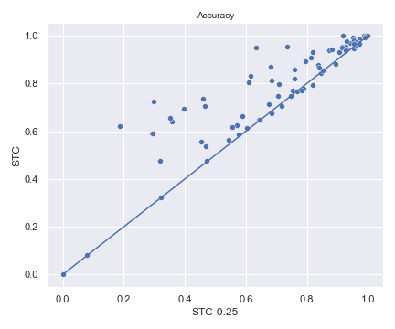
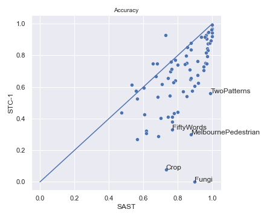
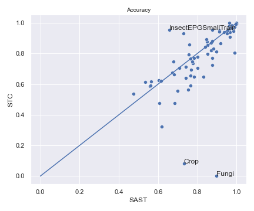
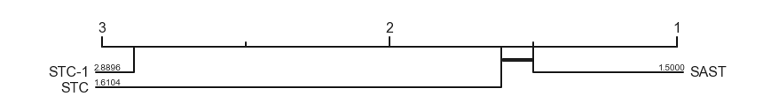
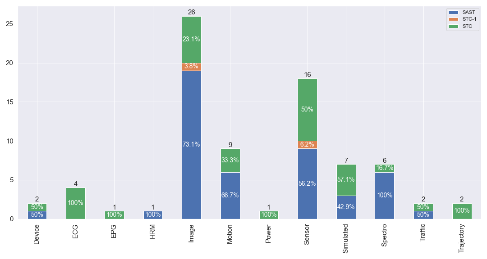
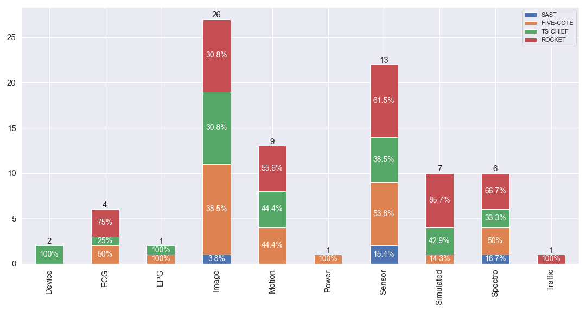

# SAST: Scalable and Accurate Subsequence Transform for Time Series Classification

SAST is a novel shapelet-based time series classification method inspired by the *core object recognition* capability of human brain. SAST is more accurate than STC while being more scalable.


SASTEN is an ensemble of 3 SAST models. SASTEN is more accurate than SAST and more scalable than STC.


SASTEN-A is an ensemble of 3 approximated SAST models. The approximation is done by considering only a subset of the subsequences in the dataset.


STC-k is a shapelet transform classifier which generate shapelet candidates from at most *k* reference time series per class. If *k* is a float, then *k x n_c* instances are used per class, where *n_c* is the total number of instances in class *c*.


### Results

- [All models results](./results/all-model-acc.csv)
- [SAST results](./results/results-rf-ridge.csv)
- [STC-k results](./results/results-stc-k.csv)
- [Approximated SAST results: SAST-A](./results/results-sast-approx.csv)
- [Ensemble of approximated SAST results: SASTEN-A](./results/results-sast-ensemble-approx.csv)
- [Ensemble of SAST results: SASTEN](./results/results-sast-ensemble-full.csv)
- [Execution time regarding the number of series](./results/results-scalability-number-of-series.csv)
- [Execution time regarding series length](./results/results-scalability-series-length.csv)


### SAST vs SASTEN

#### Pairwise accuracy comparison

|  |  |
| -------------------------------------------------- | ---------------------------------------------------- |
|            |          |

#### Critical difference diagram


### STC-k vs STC

#### Pairwise accuracy comparison

|     |  |
| --------------------------------------------------- | ----------------------------------------------------- |
|  |  |

#### Critical difference diagram


### SAST vs STC

|  |  |
| ---------------------------------------------- | --------------------------------------------- |

#### Critical difference diagram



#### Percentage of wins per problem type



### SAST vs others shapelets methods

#### Pairwise accuracy comparison

|  |  |
| ------------------------------------------------- | ----------------------------------------- |


#### Critical difference diagram


#### Percentage of wins per problem types


### SAST vs SOTA

#### Pairwise accuracy comparison

|  |  |
| ------------------------------------------------------------ | ------------------------------------------------------------ |
|                                                              |                                                              |


#### Percentage of wins per problem type




### Scalability plots

- Regarding the length of time series


- Regarding the number of time series in the dataset


### Comparison to SOTA


## Usage

```python
import numpy as np
from sast.utils import *
from sast.sast import *
from sklearn.linear_model import RidgeClassifierCV

clf = RidgeClassifierCV(alphas=np.logspace(-3, 3, 10))
sast_ridge = SAST(cand_length_list=np.arange(min_shp_length, max_shp_length+1),
		          nb_inst_per_class=nb_inst_per_class, 
		          random_state=None, classifier=clf)

sast_ridge.fit(X_train, y_train)

prediction = sast_ridge.predict(X_test)
```

### Dependencies

- numpy == 1.18.5
- numba == 0.50.1
- scikit-learn == 0.23.1
- sktime == 0.5.3

